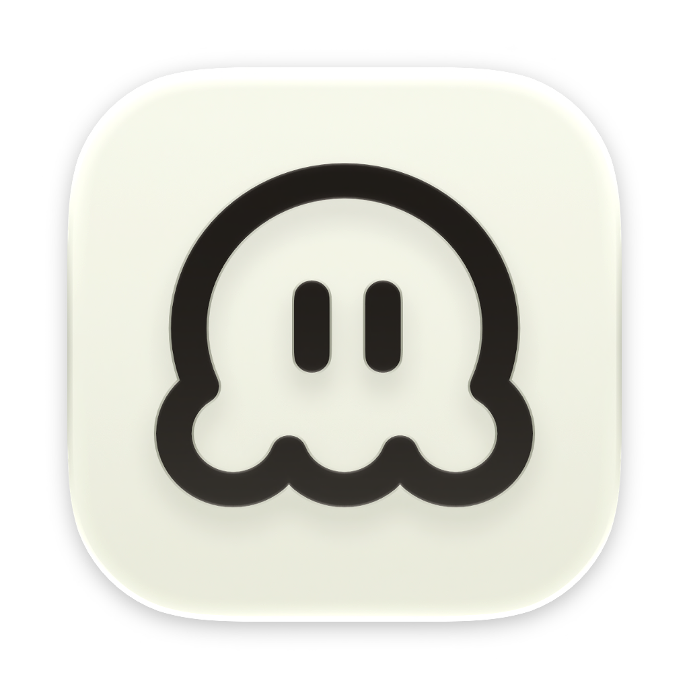

# Contributing to Vanilla Chat

<p align="center">
  
</p>

> Thanks for wanting to help! Vanilla Chat is a small, privacy-first web chat UI for local
> and cloud AI models. It stays deliberately uncomplicated — an Express server plus a
> vanilla-JS frontend, **no build step**, no frameworks.

---

## Contents
- [legel stuff](#diskette-labs)
- [Quick start](#quick-start)
- [Getting started](#getting-started)
- [Project overview](#project-overview)
- [Design notes](#design-notes)
- [Project structure](#project-structure)
- [How it works](#how-it-works)
- [How we code](#how-we-code)
- [How we design the frontend](#how-we-design-the-frontend)
- [Verifying your changes](#verifying-your-changes)
- [Git workflow](#git-workflow)
- [Troubleshooting](#troubleshooting)

---


##Diskette Labs — Contributors and Project Governance

Copyright (c) 2026 Diskette Labs. All rights reserved.

This document establishes the development structure, team responsibilities,
contributor permissions, and project governance for Software distributed
under the Diskette Labs Temporary Development License.

This document is incorporated by reference into the project's `LICENSE` and
should be read together with that license.

---

## 1. Project Leadership

The project has two primary Project Heads and Administrators:

- **Miles Wolf Allen** — Development Team Lead
- **Owen VanVooren** — Design Team Lead

Miles Wolf Allen and Owen VanVooren are responsible for overall project
administration and may make project-wide decisions concerning development,
contributors, teams, permissions, and project organization.

---

## 2. Development Teams

The project currently consists of two primary teams:

1. Development Team
2. Design Team

Each team has different responsibilities and permissions based on the work
that team performs.

Additional teams may be created as the project grows.

---

## 3. Development Team

The Development Team is responsible primarily for technical and software
development work, including:

- Writing and modifying source code.
- Implementing features.
- Fixing bugs.
- Technical testing.
- Code review.
- Development infrastructure.
- Technical research.
- Other software-development responsibilities authorized by the team.

**Team Lead:** Miles Wolf Allen

The Development Team Lead has final decision-making authority over matters
that fall within the Development Team's normal scope.

---

## 4. Design Team

The Design Team is responsible primarily for visual, creative, and
user-facing work, including:

- User interface design.
- User experience design.
- Visual design.
- Branding.
- Graphics.
- Icons.
- Design systems.
- Visual standards.
- Other creative responsibilities authorized by the team.

**Team Lead:** Owen VanVooren

The Design Team Lead has final decision-making authority over matters that
fall within the Design Team's normal scope.

---

## 5. Team Lead Authority

Each Team Lead has final say over matters within their respective team's
scope.

### Development Team

Miles Wolf Allen has final authority over Development Team matters,
including technical development decisions, development procedures, technical
assignments, and technical contributions.

### Design Team

Owen VanVooren has final authority over Design Team matters, including
creative direction, design procedures, visual assignments, branding, and
design contributions.

Team Lead authority applies to matters within the respective team's scope.

Project-wide matters involving copyright, licensing, ownership, major
project direction, or the authority of multiple teams remain subject to the
Project Heads.

---

## 6. Team Membership

Miles Wolf Allen may add, remove, or authorize individuals to join the
Development Team.

Owen VanVooren may add, remove, or authorize individuals to join the Design
Team.

Additionally, either Project Head may authorize individuals to join either
team.

Therefore:

- Miles may add people to the Development Team.
- Miles may also add people to the Design Team.
- Owen may add people to the Design Team.
- Owen may also add people to the Development Team.

Team membership grants only the permissions associated with the member's
authorized role.

---

## 7. Cross-Team Work

A contributor may work within another team's responsibilities when they
receive express permission from the appropriate Team Lead or an authorized
representative of that team.

For example:

- A Development Team member may perform Design Team work with express
  permission from Owen VanVooren or an authorized Design Team
  representative.
- A Design Team member may perform Development Team work with express
  permission from Miles Wolf Allen or an authorized Development Team
  representative.

The same principle applies to any additional teams created by the project.

Cross-team permission may apply to:

- A specific task.
- A specific feature.
- A specific project.
- A specific period of time.
- A defined set of files or systems.
- Another specifically defined scope.

Cross-team permission does not automatically change a contributor's
permanent team assignment.

---

## 8. Additional Teams

The project may establish additional teams when the Project Heads determine
that a separate team is necessary or useful.

Potential teams may include, but are not limited to:

- Documentation
- Quality Assurance
- Testing
- Security
- Infrastructure
- Community
- Research
- Marketing
- Other project-specific teams

When a new team is created, the Project Heads may:

- Define its responsibilities.
- Establish its permissions.
- Appoint a Team Lead.
- Add members.
- Remove members.
- Establish procedures for that team.

A future version of this document or the `LICENSE` may formally identify
additional teams and their members.

When a new version of the license or contributor documentation is issued
that identifies an additional team, that team and its authorized members
become part of the project's recognized development structure under that
version.

---

## 9. Adding New Developers

The project may add new contributors and developers at any time during the
development period.

Miles Wolf Allen and Owen VanVooren may authorize individuals to join the
project and may assign them to either existing or newly created teams.

Authorized Team Leads may recommend or approve contributors for work within
their respective teams, subject to the authority of the Project Heads.

Contributor authorization should identify the scope of the contributor's
responsibilities when appropriate.

---

## 10. Contributor Permissions

Being listed as a contributor, developer, or team member does not grant
unrestricted rights to the Software.

Contributors may only:

- Access project resources they are authorized to access.
- Modify files they are authorized to modify.
- Perform tasks within their assigned responsibilities.
- Use project systems for authorized project purposes.
- Participate in project discussions and development according to their
  permissions.

Unless separately authorized in writing, contributors may not:

- Sell the Software.
- Sublicense the Software.
- Redistribute the Software.
- Publish unauthorized copies.
- Create unauthorized forks.
- Create independent derivative works.
- Re-license the Software.
- Grant third parties rights that they do not possess.

---

## 11. Authority to Grant Permissions

Only Diskette Labs and individuals expressly authorized by Diskette Labs may
grant permissions that extend beyond ordinary contributor responsibilities.

A contributor cannot grant another person rights greater than the rights
the contributor themselves possesses.

Team Leads may grant permissions within their team's established scope,
including cross-team permissions where authorized by this document.

Project-wide licensing permissions remain under the authority of the Project
Heads unless expressly delegated.

---

## 12. Changes to Project Structure

The Project Heads may change:

- Team structures.
- Team responsibilities.
- Team membership.
- Team Leads.
- Contributor permissions.
- Development procedures.
- Cross-team procedures.
- Project governance.

Material changes may be documented in an updated version of this file.

---

## 13. Relationship to the LICENSE

This document is not intended to replace the project's `LICENSE`.

The `LICENSE` establishes the legal terms under which the Software may be
used.

This document establishes the project's contributor structure and
development governance.

Where this document addresses contributor permissions, those permissions
must be interpreted consistently with the `LICENSE`.

Nothing in this document overrides the copyright, licensing, redistribution,
or ownership restrictions contained in the `LICENSE`.

---

## 14. Project Information

**Organization:** Diskette Labs

**Website:**  
https://diskettelabs.com/

**GitHub:**  
https://github.com/diskettelabs

**General Contact:**  
hello@diskettelabs.com

### Project Heads

**Miles Wolf Allen**  
Development Team Lead

**Owen VanVooren**  
Design Team Lead

For licensing questions, permission requests, development access, team
membership, cross-team permissions, or other project matters, contact
Diskette Labs through the official website, GitHub organization, or general
contact address.

---

Copyright (c) 2026 Diskette Labs. All rights reserved.


## Quick start

```
./run-this-furst.sh
```

That's it. The script clones and builds the **Gelectron** desktop shell and the
**gelectron-ollama** runtime, installs all app dependencies, and launches Vanilla Chat.
Useful flags:

| Flag | What it does |
| --- | --- |
| `--run` | Install, then launch the app |
| `--no-build` | Reuse an existing Gelectron binary (skips the Rust build) |
| `--help` | Show the full option list |

Prefer the web build? See [Getting started](#getting-started) below.

## Getting started

Requirements:

- [Node.js](https://nodejs.org) 18+
- `npm` (comes with Node)
- `cargo` (Rust) only if you build Gelectron yourself — or pass `--no-build`
- Ollama or LM Studio running locally if you want to test with real models

Manual setup:

```bash
npm install
npm start
```

Open `http://localhost:2051` in your browser.

| Command | What it does |
| --- | --- |
| `npm start` | Run the web server |
| `npm start -- -g` | Launch the Gelectron desktop build |
| `npm start -- -e` | Launch the Electron desktop build |
| `npm run dev` | Run the server with `node --watch` (auto-restart on changes) |
| `npm run build` | Build the desktop app into `dist/VanillaChat.app` |

## Project overview

| Layer | Tech | Where |
| --- | --- | --- |
| Backend | Node.js + Express | `server.js`, `src/` |
| Frontend | Vanilla JS + CSS (no build step) | `public/` |
| Providers | Adapters per service | `src/providers/` |
| Desktop | Gelectron (Rust shell) / Electron (legacy) | `gelectron/`, `electron/` |
| Themes | JSON files + authoring docs | `themes/` |
| Data | JSON conversation files (gitignored) | `data/conversations/` |

## Design notes

These are the decisions that shape the code. Read them before touching a new area — the structure exists because of them.

We try to go for minimalist look, so if you clutter it up too much, we may have to take your request, your poll request, and change it. If in this event we will still give you credit, but if you could please minimize issues with overcluttering, that would be great. We also have a style guide: all styles must be and editable by the themes, so any new or added thing must be updated in the HTML page where we keep the API and supported by the front end.

For back-end work, please note that no matter what you do, it has to still work with the NoJSA server and the web front tent spawned by it. If you ever break this rule, we will have to deny your poll request. It's OK to have features that are exclusive to Galtron, but please ask for permission first

## Project structure

```
vanilla-sh/
├── server.js             Express app + static file serving
├── start.js              Launcher: web / Gelectron (-g) / Electron (-e)
├── run-this-furst.sh     One-shot installer (Gelectron + gelectron-ollama)
├── config/default.json   Server config (port, providers, timeouts)
├── src/
│   ├── routes.js         All API routes (register(app))
│   ├── search.js         Web search (DuckDuckGo default, Brave optional)
│   ├── storage.js        Conversation persistence
│   ├── upload.js         File upload / OCR handling
│   ├── titles.js         Auto-naming conversations
│   ├── system.js         CPU / RAM / GPU stats
│   ├── huggingface.js    GGUF model search + install into Ollama
│   ├── ollama.js         Ollama helpers (models, install)
│   ├── tools.js          Tool-calling loop (workspace search/web/file tools)
│   ├── workspace.js      Sandboxed file access under data/workspace/
│   ├── updater.js        Desktop app auto-update wrapper (web-safe)
│   ├── uninstall.js      Clean uninstall helpers
│   ├── lifecycle.js      Startup/shutdown hooks
│   ├── providers/        Provider adapters
│   └── errors.js
├── public/
│   ├── index.html        SPA markup
│   ├── app.js            All UI logic
│   ├── styles.css        All styling (CSS custom properties for theming)
│   ├── sounds.js         Web Audio UI sounds
│   ├── settings-ui.js    Settings helpers
│   └── assets/ music/    Static assets
├── themes/               JSON themes + themes.html authoring guide
├── gelectron/            Gelectron desktop wrapper (main.js, splash.html)
├── electron/             Legacy Electron wrapper
└── docs/                 Historical design/task notes
```

## How it works

### Request flow

1. The browser POSTs to `POST /api/chat/stream` with `{ messages, provider, model, search, searchBackend, searchApiKey, ... }`.
2. `src/routes.js` builds the provider request and streams the response back as Server-Sent Events (`text/event-stream`).
3. If `search` is true and there is a user message, `src/search.js` searches the web first and injects a system context block with citations before the last user message.
4. `public/app.js` appends tokens to the active assistant message as they arrive.

### Web search

- DuckDuckGo is the default backend (no key needed); Brave requires a `braveApiKey`.
- Search failures are non-fatal and logged via `console.error` — the chat still answers.
- `GET /api/search` is the **in-app conversation search**; the web-search test endpoint is `GET /api/websearch?q=&backend=&key=`. Don't collide with existing route names.
- The composer has a `data-tool="search"` pill that toggles it, synced with the Settings switch.

### Theming

Themes are applied client-side in `applyTheme()` (`public/app.js`): `colors.*` keys map onto CSS custom properties (`--bg`, `--text`, `--surface`, `--accent`, …), the logo/mascot SVGs are swapped, and raw CSS can be injected into a `<style id="theme-styles">`. `GET /api/themes` lists what's available.

To add a theme, drop a `.json` file in `themes/` following the schema in **`/themes/themes.html`**. Remember the SVG rules: provide a full inline `<svg>`, no `class` on the root (the app injects it), include a `viewBox`.

### Settings, toggles & sounds

- Settings is a tabbed modal (General / AI Model / Chat / Appearance / Shortcuts / Data & Privacy). The modal uses a fixed `height: min(85vh, 680px)` so it doesn't resize between tabs; the content pane scrolls.
- Settings persist from `applySettings()` (`public/app.js`) under `vanilla-*` keys in `localStorage`. There is no separate `saveSettings()` function.
- Toggle switches (`.toggle-input`) each have a `change` listener, plus one delegated listener that plays `Sounds.toggle()` — registered before the per-toggle handlers so a flick is heard even while muting.
- UI sounds come from `Sounds` (`public/sounds.js`) — Web Audio only, no audio files. The "Play UI sound effects" switch gates everything via `Sounds.setEnabled()`.

## How we code

**Frontend (`public/app.js`)**

- DOM references live in one `els = { ... }` map at the top of the file — add new elements there instead of scattering `document.querySelector` calls. App state lives in `state = { ... }`.
- Use the `api(path, { timeoutMs })` wrapper for all fetches — it normalizes errors, adds timeouts, and turns network failures into friendly messages. Don't hand-roll `fetch` + error handling.
- Wire UI with `data-*` attributes and event delegation (see the document-level click/keydown handlers), not inline `onclick`.
- Toggle switches are `.toggle-input` checkboxes with a `change` listener; the delegated sound listener is registered before per-toggle handlers so a flick is heard even while muting.
- Group related functions under section comments like `// ─── App updates ─────────`; otherwise keep comments rare.
- Keep functions small and named by their job: `renderConversationList`, `streamChat`, `handleSsePart` — one job per function.

**Backend (`src/`, `server.js`)**

- All routes are registered inside `register(app)` in `src/routes.js` — one place to see the whole API. Route handlers stay thin; real logic lives in the focused modules (`storage`, `search`, `tools`, `updater`, `workspace`, …), which export plain functions.
- `server.js` is thin: it boots the app, calls `register(app)`, and serves static dirs.
- Log with `console.error` — under Gelectron, stderr is what lands in the log file; `console.log` goes to a pipe and is invisible in the desktop log. Keep lines consistent with `formatErrorForLog(e, { endpoint })`.
- Never throw raw errors at the client. Use `formatErrorForClient` / `parseError` and set a sensible HTTP status.
- Config lives in `config/default.json`, read once as `CONFIG`. New knobs (timeouts, hosts, feed URLs) go there; env vars can override them (e.g. `VANILLA_UPDATE_FEED`).
- Keep chat resilient: search, model-list, and provider hiccups are non-fatal — the user should still be able to talk.

**Streaming protocol (SSE)**

- `Content-Type: text/event-stream`; each event is one JSON line: `data: { ... }\n\n`.
- Event types: `token` (append to the active assistant message), `tool_call`, `tool_result`, `tool_error`, `error`, `done` (`done` may carry `interrupted: true` when the user stops).
- The client buffers partial lines and feeds complete parts to `handleSsePart()`. Keep each write self-contained so a dropped connection doesn't corrupt the message.

**Other conventions**

- Vanilla everything. No new frameworks, bundlers, or CSS preprocessors. Match the patterns in the file you're editing.
- No comments unless they earn their keep. Clear naming beats comment noise.
- Colors via CSS custom properties (`var(--token, fallback)`), never hardcoded hex.
- CSS class names are kebab-case; JS uses camelCase; localStorage keys are `vanilla-*`.
- Keep it small. One focused change per PR.

## How we design the frontend

The frontend is a hand-rolled SPA in three files — `index.html` (markup skeleton), `app.js` (all logic), `styles.css` (all styling). These are the patterns that keep it coherent without a framework.

- **Markup, logic, and style never mix.** No inline `onclick`, no inline `style=`, no `<style>` blocks in components. New markup goes in `index.html`, new behavior in `app.js`, new look in `styles.css`.
- **State-driven styling via data attributes, not class toggling.** Settings and UI modes are reflected as attributes and CSS keys off them: `body[data-density="compact"]`, `body[data-text-size]`, `body[data-accent]`, `body[data-assistant-logo]`, `body[data-reduce-motion]`, `.app-shell[data-sidebar="closed"]`, `.pill-tool[data-active]`, `.model-picker[data-open]`. `applySettings()` writes them all in one place (`document.body.dataset.*`, `els.shell.dataset.*`). Add a setting → add a data attribute → style against it.
- **Design tokens are CSS custom properties; themes only override tokens.** `:root` defines `--bg`, `--surface`, `--panel`, `--line`, `--text`, `--muted`, `--bubble`, `--accent`, `--radius`, `--shadow`, `--font`, `--ui-scale`. Component rules reference only `var(--token, fallback)` — never a literal color. `applyTheme()` maps theme JSON onto the tokens, and `body[data-accent="..."]` tweaks `--bubble`.
- **Modals are backdrop + panel toggled with the `hidden` attribute.** `.modal-backdrop` is a fixed, blurred, grid-centered overlay (`z-index: 20`); `.modal` is `width: min(680px, 100vw - 32px)`, `max-height: 76vh`, with the content pane scrolling internally. Show/hide by flipping the `hidden` property (`[hidden] { display: none !important }`) — never remove elements from the DOM.
- **The settings modal is the template for settings UI.** `.settings-layout` is a flex row: a fixed 220px `.settings-tabs` rail plus a scrolling `.settings-content` pane. Panes are `.settings-tab-pane`, hidden by default, shown with `.active` (switched by `settings-ui.js`). Inside a pane, content is stacked `.settings-section` → `.settings-card` blocks using `.check-row` toggles, `.label-help` helper text, and custom `.settings-picker` dropdowns. The modal has a fixed height so it never resizes between tabs.
- **Custom dropdowns instead of `<select>`.** Every picker (model, accent, density, search backend, music track, …) is a button + menu controlled by a `data-open` attribute via the `dropdowns.*` + `createSettingsDropdown()` helpers in `app.js` — consistent theming, and the menu can overlay the composer.
- **Icons are inline SVG constants, not image files.** Icons live in the `ASSET` map or as template constants (`TRASH_SVG`, `NEW_CHAT_SVG`, `MASCOT_SVG()`) so themes can swap them and CSS can recolor them.
- **The composer is a stack of stateful parts.** The prompt textarea, toggle pills (`.pill-tool[data-tool="search"|"tools"][data-active]`), and a submit button that flips to stop via `[data-mode="stop"]`. The composer pills and the Settings switches mirror each other through `applySettings()` — keep them in sync when adding a new toggle.
- **Streaming renders as it arrives.** `streamChat` reads the SSE stream and `handleSsePart()` appends tokens to the active message; `pumpTokens()` batches the DOM writes so long answers stay smooth. Tool calls render as chips above the answer.
- **Feedback uses the existing layers.** Transient notices go through `showNotification()` (`#appNotification`), sounds through `Sounds` (`public/sounds.js`, Web Audio, gated by `Sounds.setEnabled()`). Don't add new toast or audio systems.
- **Animation is pure CSS and respects reduced motion.** Micro-interactions are `transition`/`animation` with `ease` curves (e.g. `modal-in 240ms cubic-bezier(0.2, 0.8, 0.2, 1)`). `body[data-reduce-motion="true"]` collapses every duration to ~1ms, so new animations need no extra JS to be accessible.
- **Accessibility basics are built into the patterns.** Toggles are real `<input type="checkbox">`, pills carry `aria-pressed`, modals and pickers use `hidden` and `data-open`, and keyboard handling goes through one delegated `document.addEventListener("keydown", ...)`.

## Verifying your changes

```bash
node --check public/app.js   # syntax-check the UI bundle
node --check src/routes.js   # or any other file you touched
```

- The dev server serves `public/`, `themes/`, and `ui/` straight from disk, so frontend edits are live after a hard refresh. Changes to `src/*.js` require a server restart — or use `npm run dev` (`node --watch`).
- Smoke-test with curl, e.g. `curl http://localhost:2051/api/health` and `curl 'http://localhost:2051/api/websearch?q=test'`.
- If you changed streaming behavior, test with a local model (Ollama) and confirm the response streams token-by-token.
- If you changed the settings modal, check all six tabs for consistent height and internal scrolling.

## Git workflow

1. Create a branch: `git checkout -b fix/your-change` or `git checkout -b feature/your-change`.
2. Commit messages in this repo are short and lowercase — `fixed`, `update`, `made the app compile`. Match that tone.
3. Open a PR against the main branch and describe what changed and why.

## Troubleshooting

- **Port 2051 already in use / serving stale content** — a previously installed `VanillaChat.app` may have grabbed the port. Find it with `lsof -nP -iTCP:2051 -sTCP:LISTEN`, kill the stale copy, then start the dev server.
- **Logs** — Gelectron writes stderr to the log file, not stdout. Search it for provider/search errors.
- **Search returns nothing** — DuckDuckGo needs no key; Brave requires a `braveApiKey` in Settings → Chat. Failures are logged, never fatal.
